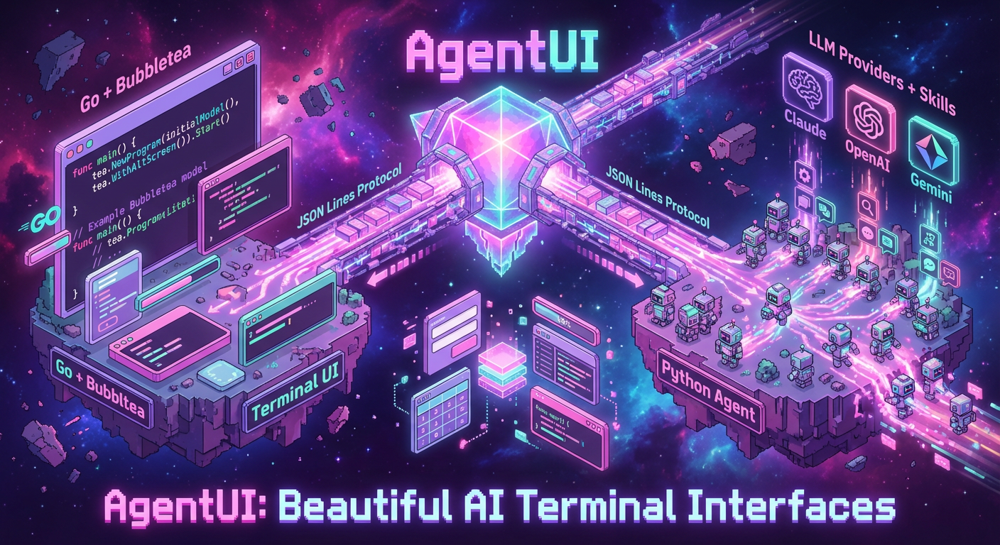

<p align="center">
  
</p>

# AgentUI 🤖✨
### *Pronounced "Agent TUI"*

> Build beautiful AI agent applications with Charm-quality terminal interfaces

<p align="center">
  
  
  
</p>

---

## 🎯 What is AgentUI? (ELI5)

**AgentUI is a framework that makes AI agents beautiful.**

Imagine you want to build an app where you chat with an AI (like ChatGPT), but instead of a web page, it runs in your terminal with gorgeous colors, smooth animations, and interactive forms. That's AgentUI.

**The magic:** You write simple Python code, and AgentUI automatically creates a stunning terminal interface with:
- ✨ Beautiful syntax-highlighted code blocks
- 📊 Interactive tables and charts
- 📝 Forms that the AI can show you
- ⚡ Real-time progress indicators
- 🎨 A gorgeous Charm aesthetic (pink, purple, teal colors)

**No web server, no browser, no complex setup** — just a beautiful terminal app that talks to AI.

### Why Terminal Apps?

- **Fast** — No browser overhead, instant startup
- **Professional** — Developers love terminal tools (git, docker, kubectl)
- **Portable** — Works over SSH, in containers, anywhere
- **Beautiful** — Modern terminals support millions of colors
- **Efficient** — Keyboard-first, no mouse required

---

## 🚀 What Can You Do With AgentUI?

AgentUI is perfect for building:

### 1. **AI Assistants with Tools**
Create agents that can execute commands, read files, call APIs, and show results beautifully:

```python
# Weather assistant example
@app.tool(name="get_weather")
def get_weather(city: str):
    return {"temp": 22, "conditions": "Sunny"}

# The AI automatically calls this when users ask about weather!
```

### 2. **Interactive Development Tools**
Build code generators, project scaffolders, or debug assistants with beautiful forms:

```python
# The AI can show interactive forms
# User fills them out in a gorgeous TUI
# Your code receives the structured data
```

### 3. **Data Processing Pipelines**
Show progress, tables, and results as your agent processes data:

```python
# Show real-time progress bars
# Display results in formatted tables
# Highlight code with syntax coloring
```

### 4. **Custom ChatGPT-style Apps**
Build your own AI chat interface with your own tools, providers, and styling.

---

## 🎨 What It Looks Like

AgentUI uses the **Charm aesthetic** — the same beautiful design language as popular CLI tools like [Glow](https://github.com/charmbracelet/glow), [Huh](https://github.com/charmbracelet/huh), and [Mods](https://github.com/charmbracelet/mods).

**Default Theme: CharmDark**
- Pink headlines (`#ff87d7`)
- Purple accents (`#7D56F4`)
- Teal highlights (`#00af5f`)
- Rounded borders everywhere
- Smooth animations

**8 Built-in Themes:**
- `charm-dark` (default) — Signature Charm colors
- `charm-light` — Light mode variant
- `charm-auto` — Auto-detects terminal background
- `catppuccin-mocha` / `catppuccin-latte` — Soothing pastels
- `dracula` — Classic vibrant dark
- `nord` — Arctic blues
- `tokyo-night` — Clean Japanese-inspired

---

## 🏗️ Architecture: How It Works

**The secret sauce:** AgentUI splits the work between two processes that talk to each other:


### The Two-Process Design

```
┌─────────────────────────────────────────────────┐
│  🖥️  Terminal (What You See)                   │
│  • Built with Go + Bubbletea                    │
│  • Renders beautiful UI                         │
│  • Handles keyboard input                       │
│  • Shows: code, tables, forms, progress         │
└─────────────────────────────────────────────────┘
                      ↕ JSON Lines Protocol
┌─────────────────────────────────────────────────┐
│  🐍  Python Agent (The Brains)                  │
│  • Talks to Claude, OpenAI, Gemini              │
│  • Executes your tools                          │
│  • Manages context & memory                     │
│  • Decides what UI to show                      │
└─────────────────────────────────────────────────┘
```

### Why This Design?

**1. Best of Both Worlds**
- **Go** for blazing-fast UI rendering and smooth animations
- **Python** for AI/ML ecosystem and easy tool development

**2. Separation of Concerns**
- UI rendering is independent from AI logic
- Easy to test components in isolation
- Can swap LLM providers without touching UI

**3. Clean Communication**
- Simple JSON messages over stdin/stdout
- No HTTP servers, no sockets, no complexity
- Works anywhere (local, SSH, containers)

### What Happens When You Type a Message?

Let's trace a simple request through the system:

```
1. You type: "What's the weather in Paris?"
   └─ Go TUI captures your input

2. Go sends JSON to Python:
   {"type": "user_message", "content": "What's the weather in Paris?"}
   └─ Via stdin/stdout pipe

3. Python sends it to Claude/OpenAI/Gemini:
   "User asks: What's the weather in Paris?"
   └─ LLM sees your tools available

4. LLM responds: "I should call get_weather tool"
   └─ Returns structured tool call

5. Python executes your tool:
   get_weather("Paris") → {"temp": 18, "conditions": "Rainy"}
   └─ Your Python function runs

6. Python sends UI command to Go:
   {"type": "table", "data": [["Temp", "18°C"], ["Conditions", "Rainy"]]}
   └─ JSON message with formatting

7. Go renders beautiful table:
   ╭────────────────────────────╮
   │ Weather in Paris           │
   ├────────────┬───────────────┤
   │ Temp       │ 18°C          │
   │ Conditions │ Rainy         │
   ╰────────────┴───────────────╯
   └─ Using Charm styling

8. You see the result instantly!
```

**All this happens in milliseconds**, and you just see a beautiful, smooth interface.

---

## 🚀 Quick Start

### Installation

```bash
# Clone the repository
git clone https://github.com/flight505/agentui
cd agentui

# Install dependencies (uses uv for fast Python package management)
uv sync

# Build the Go TUI binary
make build-tui
```

### Your First Agent

Create a simple weather assistant:

```python
# my_agent.py
import asyncio
from agentui import AgentApp

# Create your app
app = AgentApp(
    name="weather-assistant",
    provider="claude",  # or "openai" or "gemini"
    theme="charm-dark"
)

# Define a tool the AI can call
@app.tool(
    name="get_weather",
    description="Get current weather for a city",
    parameters={
        "type": "object",
        "properties": {
            "city": {"type": "string", "description": "City name"}
        },
        "required": ["city"]
    }
)
def get_weather(city: str) -> dict:
    """Your tool implementation"""
    # In reality, call a weather API
    return {
        "city": city,
        "temperature": 22,
        "conditions": "Sunny",
        "humidity": "65%"
    }

# Run the agent
asyncio.run(app.run())
```

**Run it:**

```bash
# Set your API key
export ANTHROPIC_API_KEY="your-key-here"

# Run the agent
uv run python my_agent.py
```

You'll see a beautiful TUI where you can chat with the AI, and it will automatically call your `get_weather` function when appropriate!

### Data-Driven UI: Auto Component Selection

Tools return plain data structures — AgentUI automatically selects the optimal UI component:

```python
@app.tool(
    name="get_users",
    description="Get list of users from database"
)
def get_users():
    # Return list of dicts → automatically becomes a table
    return [
        {"name": "Alice", "role": "Admin", "status": "Active"},
        {"name": "Bob", "role": "User", "status": "Active"},
        {"name": "Carol", "role": "User", "status": "Inactive"}
    ]

@app.tool(
    name="analyze_code",
    description="Analyze a code file"
)
def analyze_code(file_path: str):
    # Return code string → automatically becomes syntax-highlighted code block
    with open(file_path) as f:
        return f.read()  # Framework detects language from extension
```

**The magic:** You just return Python data structures. The framework sees:
- List of dicts with consistent keys → Renders as table
- String with code patterns → Renders as syntax-highlighted code
- Dict with "percent" key → Renders as progress bar

No UI coupling in your tool logic!

### Dashboard Layouts: Multi-Component Views

Compose multiple UI components into dashboard-style layouts:

```python
from agentui import UILayout

@app.tool(
    name="system_dashboard",
    description="Show system health dashboard"
)
def system_dashboard():
    return (
        UILayout(title="🖥️ System Status")
        .add_table(
            columns=["Service", "Status", "Uptime"],
            rows=[
                ["API Server", "✓ Running", "99.9%"],
                ["Database", "✓ Running", "99.8%"],
                ["Cache", "✓ Running", "100%"]
            ],
            area="left"
        )
        .add_progress(
            message="CPU Usage",
            percent=65,
            area="right-top"
        )
        .add_progress(
            message="Memory Usage",
            percent=42,
            area="right-bottom"
        )
    )
```

The TUI automatically arranges components based on the `area` hints, creating beautiful multi-panel dashboards.

---

## 🎭 Generative UI: The Hidden Power

Here's where AgentUI gets really cool: **The AI can create UI elements on the fly.**

### Example: Dynamic Forms

```python
@app.tool(name="configure_project")
async def configure_project():
    """Let the AI show a configuration form"""
    from agentui.primitives import UIForm, FormField

    return UIForm(
        title="🚀 Project Setup",
        fields=[
            FormField("name", "Project Name", "text", required=True),
            FormField("language", "Language", "select",
                     options=["Python", "Go", "TypeScript"]),
            FormField("include_tests", "Include Tests?", "checkbox"),
        ]
    )
```

When the AI decides users need to configure something, it **generates a beautiful interactive form** in the terminal. You fill it out with arrow keys and enter, and the data goes back to the AI.

### UI Primitives Available

The AI can generate:

| Primitive | What It Does | Example Use Case |
|-----------|-------------|------------------|
| **UICode** | Syntax-highlighted code blocks | Show generated code |
| **UITable** | Data tables with headers | Display query results |
| **UIForm** | Interactive forms | Collect user input |
| **UIConfirm** | Yes/No prompts | Confirm destructive actions |
| **UIProgress** | Progress bars | Show long-running tasks |
| **UIMarkdown** | Formatted text | Render documentation |

**The magic:** You don't write any UI code. The AI decides what to show, and AgentUI renders it beautifully.

---

## 🛠️ Development Guide

### Project Structure

```
agentui/
├── cmd/agentui/              # Go TUI entry point
│   └── main.go               # Starts TUI, handles CLI args
├── internal/                 # Go internal packages
│   ├── app/                  # Bubbletea application
│   ├── protocol/             # JSON message handling
│   ├── ui/views/             # UI components (forms, tables, etc.)
│   └── theme/                # Theme system (CharmDark, etc.)
├── src/agentui/              # Python package
│   ├── app.py                # AgentApp - main API
│   ├── core.py               # Agent execution loop
│   ├── bridge.py             # Python ↔ Go communication
│   ├── protocol.py           # Message types
│   ├── primitives.py         # UI primitives (UICode, UITable, etc.)
│   ├── providers/            # LLM provider implementations
│   │   ├── claude.py         # Anthropic Claude
│   │   ├── openai.py         # OpenAI GPT
│   │   └── gemini.py         # Google Gemini
│   └── testing/              # ComponentTester framework
│       ├── component_tester.py   # Test UI components
│       ├── snapshot.py           # Regression testing
│       └── assertions.py         # ANSI assertions
└── examples/                 # Example agents
    ├── simple_agent.py       # Basic weather assistant
    └── generative_ui_demo.py # Shows all UI primitives
```

### The Communication Protocol

Messages between Python and Go are simple JSON:

**Python → Go (Show UI)**
```json
{
  "type": "code",
  "payload": {
    "title": "Generated Code",
    "language": "python",
    "code": "def hello():\n    print('world')"
  }
}
```

**Go → Python (User Input)**
```json
{
  "type": "user_message",
  "content": "Write a Python function",
  "timestamp": 1234567890
}
```

**Request/Response Pattern** (for forms, confirmations):
```json
// Python asks a question
{
  "type": "confirm",
  "id": "uuid-1234",
  "payload": {"message": "Delete all files?"}
}

// Go sends answer back
{
  "type": "response",
  "id": "uuid-1234",
  "payload": {"confirmed": false}
}
```

### Adding a New LLM Provider

1. Create `src/agentui/providers/yourprovider.py`
2. Implement async streaming + tool calling
3. Match the interface from `providers/claude.py`
4. Register in `app.py`

Example structure:
```python
class YourProvider:
    async def stream_with_tools(self, messages, tools):
        # 1. Send to LLM API
        # 2. Stream responses
        # 3. Handle tool calls
        # 4. Yield events
        pass
```

### Testing

**Component Testing** (like Storybook for TUIs):

```python
from agentui.testing import ComponentTester, ANSIAsserter

tester = ComponentTester(theme="charm-dark")
asserter = ANSIAsserter()

# Test code rendering
result = tester.render_code("python", "def hello(): pass")

assert result.success
asserter.assert_has_pink_keywords(result.output)  # CharmDark theme
asserter.assert_has_teal_strings(result.output)
```

**Run tests:**
```bash
# All tests
uv run pytest tests/ -v

# Just component tests
uv run pytest tests/test_component_tester.py -v

# Go tests
make test-go
```

**Headless Mode** (for CI/CD):
```bash
# Test TUI rendering without a terminal
echo '{"type":"code","payload":{"language":"python","code":"x=1"}}' | \
  ./bin/agentui-tui --headless --theme charm-dark
```

---

## 🎨 Themes

AgentUI uses the **Charm aesthetic** by default — the same beautiful design as tools like Glow and Huh.

### Built-in Themes

```bash
# List all themes
uv run python -m agentui.cli themes
```

**Output:**
```
→ charm-dark           Charm signature pink/purple/teal on dark (default)
  charm-light          Charm light mode with purple accents
  charm-auto           Auto-detect terminal background
  catppuccin-mocha     Soothing dark with purple accents
  catppuccin-latte     Light mode with soft colors
  dracula              Classic dark theme
  nord                 Arctic, bluish colors
  tokyo-night          Vibrant dark theme
```

### Custom Themes

Create a JSON theme file:

```json
{
  "id": "my-theme",
  "name": "My Custom Theme",
  "author": "Your Name",
  "colors": {
    "primary": "#7D56F4",
    "background": "#1a1a2e",
    "text": "#FAFAFA",
    "success": "#04B575",
    "error": "#ff6b6b"
  }
}
```

Load it:
```bash
./bin/agentui-tui --theme /path/to/my-theme.json
```

See `themes/README.md` for complete theme documentation.

---

## 📚 Documentation

### For Users
- **This README** — Start here!
- [Component Testing Guide](./docs/COMPONENT_TESTING.md) — Test your UI components
- [Theme Documentation](./themes/README.md) — Create custom themes

### For Contributors
- [CLAUDE.md](./CLAUDE.md) — Architecture, workflows, constraints (for Claude Code)
- [Charm Aesthetic Plan](./docs/plans/2026-01-17-charm-aesthetic-implementation.md) — Theme system design
- [Storybook Expansion](./docs/STORYBOOK_ASSISTANT_EXPANSION.md) — Future plugin ideas

### Status & Proofs
- [Component Tester Summary](./COMPONENT_TESTER_SUMMARY.md) — Testing framework status
- [Syntax Highlighting Proof](./SYNTAX_HIGHLIGHTING_VERIFIED.md) — Chroma v2 verification
- [Nano Banana Setup](./NANO_BANANA_SETUP.md) — Diagram generation tool

---

## 🗺️ Roadmap

### ✅ Complete (Ready to Use!)

- ✅ **Two-process architecture** — Python ↔ Go via JSON Lines
- ✅ **LLM providers** — Claude, OpenAI, Gemini support
- ✅ **Charm aesthetic** — CharmDark theme with pink/purple/teal
- ✅ **UI primitives** — Code, tables, forms, progress, confirmations
- ✅ **Syntax highlighting** — Chroma v2 with 8x ANSI output (verified)
- ✅ **Component testing** — ComponentTester framework (like Storybook)
- ✅ **Headless mode** — Automated testing without TTY
- ✅ **Skills system** — Load tools from SKILL.md files
- ✅ **8 themes** — CharmDark, CharmLight, community themes
- ✅ **JSON theme loader** — Extensible theme system

### 🚧 In Progress

- 🚧 **CI/CD integration** — Automated component testing
- 🚧 **PyPI package** — Easy `pip install agentui`
- 🚧 **More examples** — Showcase different use cases

### 📋 Planned

- 📋 **MCP integration** — Model Context Protocol support
- 📋 **Plugin marketplace** — Share skills and themes
- 📋 **Storybook plugin** — Visual component testing
- 📋 **Recording mode** — Record sessions as GIFs

---

## 🤝 Contributing

We'd love your help! Here's how:

1. **Report bugs** — Open an issue with reproduction steps
2. **Request features** — Tell us what you'd build with AgentUI
3. **Create themes** — Add your theme to `themes/` and submit a PR
4. **Build examples** — Show off what AgentUI can do
5. **Improve docs** — Help others understand the framework

See [CONTRIBUTING.md](./CONTRIBUTING.md) for guidelines.

---

## ❓ FAQ

### Why not just use Rich or Textual?

**Rich** is amazing for formatting output, but it's not interactive. AgentUI needs:
- Stateful UI (forms, menus, live updates)
- Event handling (keyboard input)
- Smooth animations

**Textual** is closer, but:
- Python TUIs are slower than Go for intensive rendering
- AgentUI wants the Python for AI logic, Go for UI performance
- Separation allows testing UI without LLM calls

### Can I use this without AI?

Yes! The two-process architecture works for any Python app that wants a beautiful Go TUI. You don't need LLM providers — just send UI primitives from Python to Go.

### Does it work on Windows?

The Go TUI works on Windows Terminal and modern terminals. Some features (like CharmAuto theme detection) work best on Unix-like systems.

### How much does it cost?

AgentUI is **free and open source** (MIT license). You only pay for LLM API calls to Claude, OpenAI, or Gemini — same as using them directly.

### Can I package it as a single binary?

Yes! The Go TUI is a single binary. For Python, use PyInstaller or similar to bundle everything together.

---

## 📄 License

MIT License — see [LICENSE](./LICENSE) for details.

---

## 🙏 Acknowledgments

Built with love using:
- [Charm](https://charm.sh) — Beautiful terminal UIs
- [Bubbletea](https://github.com/charmbracelet/bubbletea) — TUI framework
- [Lip Gloss](https://github.com/charmbracelet/lipgloss) — Styling
- [Chroma](https://github.com/alecthomas/chroma) — Syntax highlighting
- [Anthropic](https://anthropic.com) — Claude API
- [OpenAI](https://openai.com) — GPT API
- [Google](https://ai.google.dev/) — Gemini API

---

<p align="center">
  <strong>Made with 💜 using <a href="https://charm.sh">Charm</a></strong><br>
  <sub>Because terminals deserve to be beautiful too</sub>
</p>
